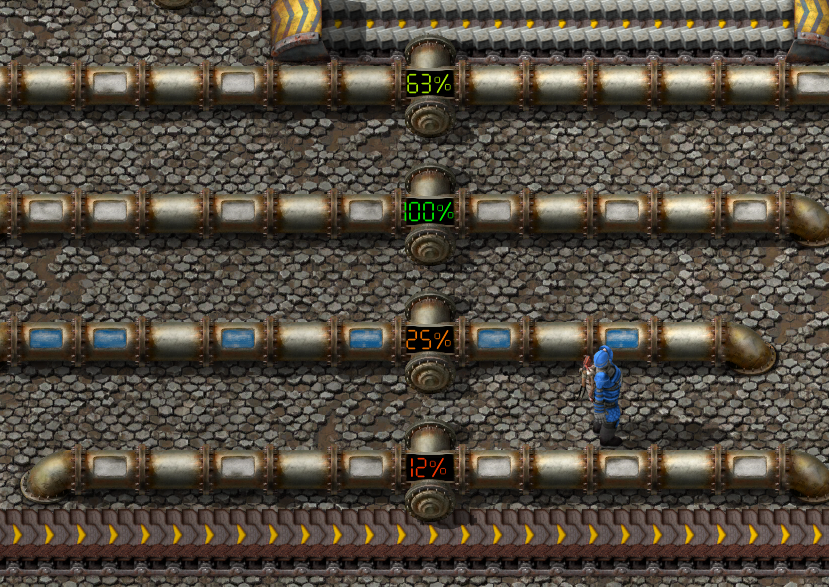

# Fluid-level-indicator

Fluid level indicator with a numerical display, that changes color based on how full the fluid system is. You can attach it to a tank to measure the fluid level or can be used as replacement for pipes to see when to add a pump. 

]
